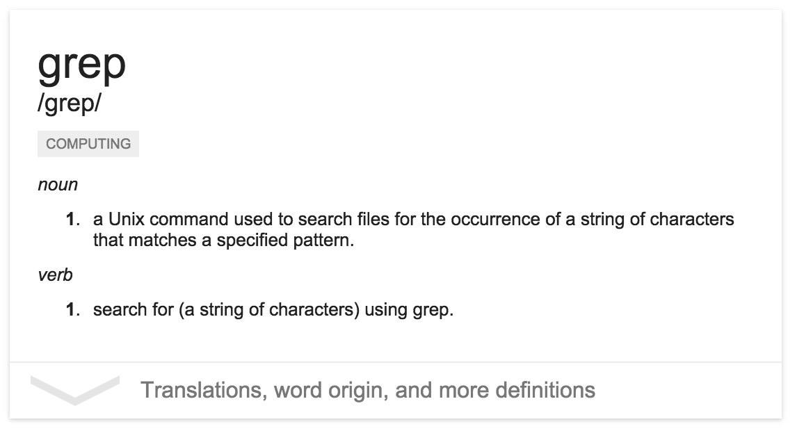

## What is grep

Grep is one of the most powerful tools at your terminal's disposal. Grep is incredibly powerful at find files, phrases and sifting through the _stdout/stdin_.



Most developers have used grep for sifting through output with commands like these:
~~~ bash
$ cat file.log | grep "some value"

$ ls | grep file.txt
~~~

Grep is much more capable than meets the eye, however.

## Common Commands  

Few realize that grep can handle most commands like these directly, avoiding the need to an extra operation. Say you need to search a multi-gigabyte file for some string? Simply using `grep 'value' filename.txt` can save an entire read operation by sorting through the file in place. 

Grep's ```-i``` flag ignores case for your searches. For instance searching through a directory's worth of files for `string` or `String` can be done with a single bash command:

~~~ bash
$ grep -r -i 'bash'

./posts/grep.md:Grep's ```-i``` flag ignores case for your searches. For instance searching through a directory's worth of files for `string` or `String` can be done with a single bash command:
./posts/grep.md:~~~ bash
~~~

Taking this a step further, you can exclude a subset of a result set with the `-v` flag. For instance to find all of the lines in a file that don't have the word `string` or `String` you can do something like this:

> _**grep.txt**_
~~~ txt
string
String
value
~~~

~~~ bash
$ grep -iv 'string' file.txt

value
~~~

## Digging Deeper

A quick `man grep` can be super enlightening, a few other handy search options include:

* `-e pattern, --regexp-pattern` -- interpret pattern as a regex statement
* `-w, --word-regexp` -- search for given expression as a word. Similar to being surrounded by `[[:<:]]` and `[[:>:]]`
* `-x, --line-regexp` -- only consider _entire_ lines that match the expression

For example, to grep a file for a line that matches `this is a line`

> _**grep.txt**_

~~~ txt
string
String
this is a line
~~~

~~~ bash
$ grep -x 'this is a line' grep.txt

this is a line
~~~

To search a file for lines that start with a number formatted as such `1.)`:
> _**grep.txt**_

~~~ txt
1.) line 1
22.) line 22
# some comment
~~~

~~~ bash
$ grep -e '^[0-9]+\.\)' grep.txt

1.) line 1
22.) line 22
~~~

Searching a file or filtering stdin with more than one expression doesn't require piping from grep to grep like `grep 'string' file.txt | grep 'search'`. In fact, grep allows you to pass multiple search expressions at a time:

> _**grep.txt**_

~~~ txt
value_1
value_2
value_3
~~~

~~~ bash
$ grep 'value_1|value_2' grep.txt

value_1
value_2
~~~

## Other options

Grep is enormously configurable, here are some other useful options:

* `-o, --only-matching` **-** print only the matching part of the line
* `-c, --count` **-** only output the number of matches
* `-m num, --max-count=num` **-** stop reading after num matches
* `-n, --line-number` **-** add the line number to each match

> _**grep.txt**_

~~~ txt
not matching
matched line
matched line
not matching
~~~

_Find matches with line number:_
~~~ bash
$ grep -on 'matched' 

2:matched
3:matched
~~~

_Count the matches:_
~~~ bash
$ grep -c 'matched' grep.txt

2
~~~

To output the context around a matched result:

* `-C[num], --context[=num]` **-** print lines above or below the matched line; defaults to 2
* `-B[num]` **-** output context before matched 
* `-A[num]` **-** output context after matched

> _**grep.txt**_

~~~ txt
line above
line above
matched line
line below
not matched
not matched
~~~

~~~ bash
$ grep -B 1 'matched line' grep.txt

line above
matched line
~~~

## Further Reading

* todo
* todo
* todo


